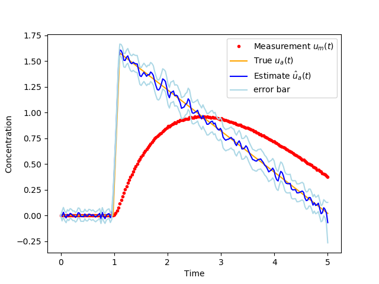

Diffusion equation inversion

diffeq.py is a linear least-squares solution using Tikhonov regularization of the 2nd order derivative of the solution.

meth_inversion.py is a non-linear solution using MCMC and L1 norm minimization of the 2nd order derivative of the solution.

This is an example of using MCMC to deconvolve a one dimensional diffusion equation. This can be used e.g., for estimating concentration of a trace quantity measured by a slowly responding sensor that is affected by diffusion of a trace gas into the sensor.

